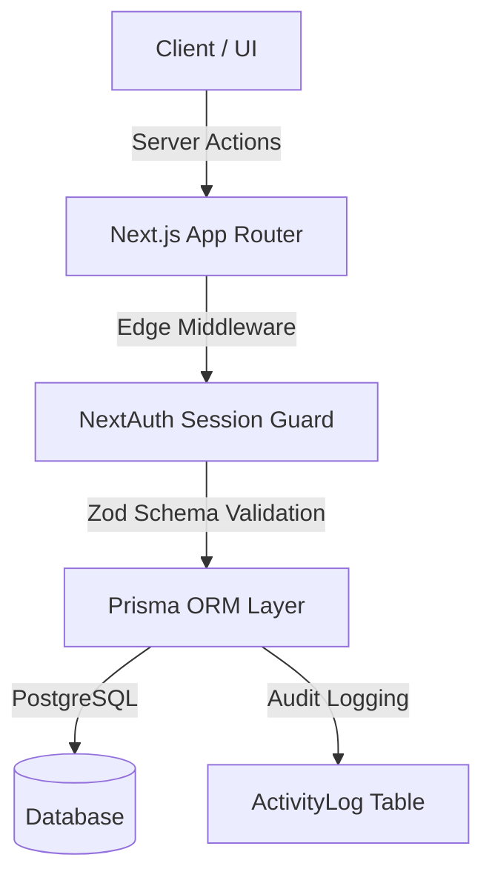

# 🎯 HireTrack

> A modern, full-stack Applicant Tracking System (ATS) built for lean hiring teams and recruitment workflows.

---

## ✨ Features

- **📊 Kanban Candidate Pipeline**: Interactive drag-and-drop recruitment stages with instantaneous status transitions and optimistic UI updates.
- **🛡️ Enterprise Role-Based Access Control (RBAC)**: Workspace permissions with strictly enforced `Admin`, `Member`, and `Viewer` capabilities.
- **✉️ Seamless Invitation & Onboarding Flow**: Secure email-bound invitation system that automatically validates pending workspace invites upon verified OAuth/credentials sign-in.
- **📝 Structured Interview Scorecards**: Standardized 1–5 scoring rubric covering technical competency, cultural fit, and communication skills.
- **📅 Interview Scheduling**: Manage upcoming candidate interviews and synchronization.
- **🔒 Production-Grade Authentication**: NextAuth.js JWT session handling with bcrypt password hashing and OAuth (Google & GitHub) protected at the Edge Middleware layer.
- **⚡ Performance & Validation**: Server Actions with end-to-end Zod schema validation and optimized Prisma ORM queries.
- **🌓 Dynamic Theme**: Responsive interface with automatic Dark/Light mode theme switching.

---

## 🛠️ Tech Stack

- **Framework**: Next.js 16 (App Router, Server Actions)
- **Language**: TypeScript (Strict Mode)
- **Database & ORM**: PostgreSQL via Prisma ORM
- **Authentication**: Auth.js / NextAuth (JWT Strategy + OAuth + Credentials)
- **Styling**: Tailwind CSS & Lucide Icons
- **Validation**: Zod Schemas

---

## 🚀 Quick Start

### 1. Clone & Install
```bash
git clone https://github.com/zokomon871/Hiretrack.git
cd Hiretrack
npm install
```

### 2. Configure Environment Variables
Create a `.env` file from the template:
```bash
cp .env.example .env
```

| Variable | Description |
| :--- | :--- |
| `DATABASE_URL` | PostgreSQL connection string |
| `AUTH_SECRET` | Secret key for signing NextAuth JWT sessions |
| `NEXTAUTH_URL` | Application root URL (`http://localhost:3000`) |
| `AUTH_GOOGLE_ID` | *(Optional)* Google OAuth Client ID |
| `AUTH_GOOGLE_SECRET` | *(Optional)* Google OAuth Client Secret |
| `AUTH_GITHUB_ID` | *(Optional)* GitHub OAuth Client ID |
| `AUTH_GITHUB_SECRET` | *(Optional)* GitHub OAuth Client Secret |

### 3. Initialize Database & Run
```bash
npm run db:migrate
npm run db:seed
npm run dev
```
Open [http://localhost:3000](http://localhost:3000) to view the application.

---

## 🏗️ Architecture & Data Flow



See [docs/architecture.md](docs/architecture.md) for detailed entity-relationship diagrams and schema specifications.

---

## 🧪 Testing & Verification

Run ESLint and TypeScript checks:
```bash
npm run lint
```

---

## 🔑 Development Sandbox Credentials

To explore pre-seeded data without creating a new workspace:
- **Email:** `alice@acmecorp.com` *(Role: Admin)*
- **Password:** `password123`

---

## 🗺️ Roadmap
- [x] Drag-and-drop candidate pipeline
- [x] 1-to-1 interview scorecards & rating summaries
- [x] Role-based workspace invitations
- [ ] Public `/careers` portal for incoming job applicants
- [ ] Google Calendar / Outlook integration for interview scheduling

---

## 📄 License
Distributed under the MIT License. See [LICENSE](LICENSE) for more information.
