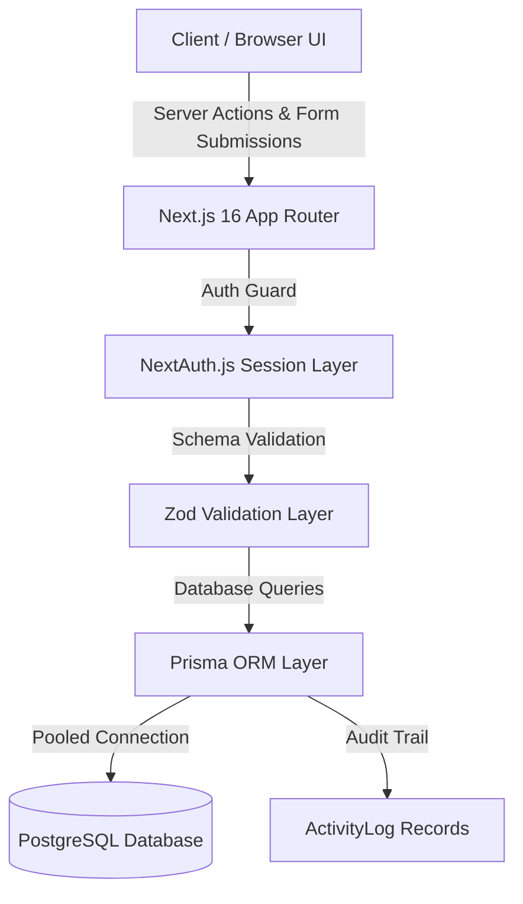

# ⚡ HireTrack

<div align="center">


<br />

**A modern, full-stack Applicant Tracking System (ATS) and Recruitment Operating System built with Next.js 16, React 19, Prisma ORM, and PostgreSQL.**

[Features](#-key-features) • [Architecture](#-architecture--data-flow) • [Tech Stack](#-technology-stack) • [Database Models](#-database-schema) • [Getting Started](#-getting-started) • [Environment Variables](#-environment-configuration)

</div>

---

## 🌟 Key Features

### 🎯 Recruitment Workstation & Pipeline
- **Kanban Candidate Pipeline**: Interactive recruitment workstation tracking candidates across stages (`APPLIED`, `SCREENING`, `INTERVIEW`, `OFFER`, `HIRED`, `REJECTED`).
- **Live Stage Updates**: Instant stage transitions powered by Next.js Server Actions with optimistic UI updates.
- **Bulk Candidate Actions**: Advance, evaluate, or archive multiple candidates simultaneously.
- **Smart Search & Filters**: Instant full-text search across candidates, jobs, and departments (`⌘K` Command Palette integration).

### 🏢 Multi-Tenant Workspace Architecture
- **Tenant Isolation**: Secure workspace segmentation ensuring teams only access their own jobs, applicants, and scorecards.
- **Enterprise RBAC**: Role-Based Access Control enforcing `ADMIN`, `MEMBER`, and `VIEWER` permissions across workflows.
- **Seamless Invitations**: Token-based email invitation onboarding flow with automatic workspace assignment upon sign-up.

### 📝 Structured Interview Scorecards
- **Performance Rubric**: Standardized 1–5 scoring rubric evaluating Technical Skills, Cultural Alignment, and Communication.
- **Reviewer Feedback**: Timestamped qualitative evaluation notes with candidate interview history.
- **Interview Coordination**: Status tracking (`SCHEDULED`, `COMPLETED`, `CANCELLED`) with interviewer assignment.

### 🎨 Midnight Obsidian Design System
- **Ergonomic Aesthetic**: Inspired by Linear and Raycast, featuring deep midnight obsidian backdrops (`#090c15`), luminous translucent borders, and signature Electric Periwinkle accents (`#7b9bfd`).
- **Adaptive Dark/Light Mode**: Smooth transitions managed via `next-themes` with zero layout shift.
- **Custom Brand Identity**: Bespoke squircle vector brand logo and cross-platform high-DPI icon assets.

---

## 🏗️ Architecture & Data Flow



---

## 🗄️ Database Schema

Powered by **Prisma ORM** connecting to **PostgreSQL**:

| Model | Description | Relations & Cascades |
| :--- | :--- | :--- |
| `User` | Platform user accounts | Accounts, Sessions, Memberships, Scorecards, Activity |
| `Account` | OAuth authentication credentials | Cascades to `User` (Google & GitHub) |
| `Session` | NextAuth session tracking | Cascades to `User` |
| `VerificationToken` | Passwordless / Email verification | Unique compound token identifier |
| `Workspace` | Multi-tenant organization | Cascades to Members, Jobs, Invites, Activity |
| `WorkspaceMember` | Workspace RBAC memberships | Maps `User` ↔ `Workspace` (`ADMIN`, `MEMBER`, `VIEWER`) |
| `Invitation` | Pending workspace invitations | Unique token expiration bound to invited email |
| `Job` | Job openings & requisitions | Cascades to `Candidate` records (`OPEN`, `DRAFT`, `CLOSED`) |
| `Candidate` | Applicant profile & pipeline stage | Cascades to `Interview` (`APPLIED` → `HIRED`) |
| `Interview` | Scheduled evaluations | Cascades to `Scorecard`, links candidate & interviewer |
| `Scorecard` | 1–5 candidate evaluation rubric | Linked 1-to-1 with `Interview` |
| `ActivityLog` | Immutable audit trail | Workspace-wide activity history & user attribution |

---

## 🛠️ Technology Stack

| Layer | Technologies |
| :--- | :--- |
| **Frontend Framework** | [Next.js 16](https://nextjs.org/) (App Router, React Server Components, Server Actions) |
| **Core UI** | [React 19](https://react.dev/), [Tailwind CSS v4](https://tailwindcss.com/), [Lucide Icons](https://lucide.dev/) |
| **Design System** | Midnight Obsidian, Translucent Glassmorphism, CSS Variables, `next-themes` |
| **Database & Engine** | [PostgreSQL](https://www.postgresql.org/) with connection pooling |
| **ORM** | [Prisma 7](https://www.prisma.io/) with `@prisma/adapter-pg` |
| **Authentication** | [Auth.js / NextAuth v5](https://authjs.dev/) (Credentials + Google OAuth + GitHub OAuth) |
| **Validation** | [Zod 4](https://zod.dev/) type-safe runtime validation |
| **Feedback & Dialogs** | [Sonner](https://sonner.emilkowal.ski/) toast notifications |

---

## 🚀 Getting Started

### Prerequisites
- **Node.js**: v20.x or v22.x+
- **npm** or **pnpm**
- A **PostgreSQL** database (e.g. Neon, Supabase, or local instance)

### 1. Clone & Install
```bash
git clone https://github.com/zokomon871/Hiretrack.git
cd Hiretrack
npm install
```

### 2. Configure Environment Variables
Copy `.env.example` to `.env` (or configure `.env` directly):
```bash
cp .env.example .env
```

### 3. Generate Prisma Client & Run Migrations
```bash
npx prisma generate
npx prisma db push
```

*(Optional) Seed the database with sample jobs, candidates, and workspaces:*
```bash
npx prisma db seed
```

### 4. Start the Development Server
```bash
npm run dev
```

Open [http://localhost:3000](http://localhost:3000) in your browser.

---

## ⚙️ Environment Configuration

Configure your `.env` file with the following parameters:

```env
# -------------------------------------------------------------------
# Database Configuration (PostgreSQL)
# -------------------------------------------------------------------
DATABASE_URL="postgresql://<user>:<password>@<host>/<dbname>?sslmode=require"

# -------------------------------------------------------------------
# Authentication (NextAuth / Auth.js)
# -------------------------------------------------------------------
AUTH_SECRET="generate-a-secure-32-byte-hex-string"
NEXTAUTH_URL="http://localhost:3000"

# -------------------------------------------------------------------
# OAuth Providers (Optional)
# -------------------------------------------------------------------
AUTH_GOOGLE_ID="your-google-oauth-client-id"
AUTH_GOOGLE_SECRET="your-google-oauth-client-secret"

AUTH_GITHUB_ID="your-github-oauth-client-id"
AUTH_GITHUB_SECRET="your-github-oauth-client-secret"
```

---

## 📁 Project Structure

```
Hiretrack/
├── prisma/
│   ├── schema.prisma            # Complete database schema
│   └── seed.ts                  # Seed script with demo workspaces & candidates
├── public/
│   ├── icon.svg                 # Brand squircle logo
│   ├── favicon.ico              # Multi-resolution favicon
│   └── apple-touch-icon.png     # iOS bookmark icon
├── src/
│   ├── app/
│   │   ├── (auth)/
│   │   │   ├── login/           # Authentication portal
│   │   │   └── signup/          # Workspace registration & onboarding
│   │   ├── dashboard/           # Workspace ATS Cockpit
│   │   │   ├── candidates/      # Candidate review & workstation
│   │   │   ├── jobs/            # Vacancy & job openings manager
│   │   │   ├── interviews/      # Interview calendar & scorecards
│   │   │   └── team/            # Team members, invitations, RBAC
│   │   ├── api/                 # Auth & search endpoints
│   │   ├── globals.css          # Midnight Obsidian design tokens & utilities
│   │   └── layout.tsx           # Root shell with smooth theme providers
│   ├── components/
│   │   ├── dashboard-sidebar.tsx# Workspace navigation
│   │   ├── brand-logo.tsx       # Vector squircle logo component
│   │   ├── command-palette.tsx  # ⌘K global quick search
│   │   └── theme-toggle.tsx     # Light/Dark mode switcher
│   ├── lib/
│   │   ├── actions/             # Next.js Server Actions (CRUD & business logic)
│   │   │   ├── candidates.ts    # Candidate actions & stage advances
│   │   │   ├── jobs.ts          # Job creation & updates
│   │   │   └── invite.ts        # Workspace invitation actions
│   │   ├── prisma.ts            # Prisma client instance & PG connection pool
│   │   └── utils.ts             # Styling & classnames utilities
│   ├── auth.ts                  # NextAuth initialization & callbacks
│   └── proxy.ts                 # Next.js request routing proxy
```

---

## 🧪 Available Scripts

| Command | Action |
| :--- | :--- |
| `npm run dev` | Starts development server on `http://localhost:3000` |
| `npm run build` | Compiles optimized production bundle |
| `npm run start` | Launches production server |
| `npm run lint` | Runs Next.js & ESLint code quality checks |
| `npx tsc --noEmit` | Runs strict TypeScript type verification |
| `npx prisma studio` | Launches Prisma GUI database browser |

---

## 📄 License

Distributed under the **MIT License**. See `LICENSE` for details.
