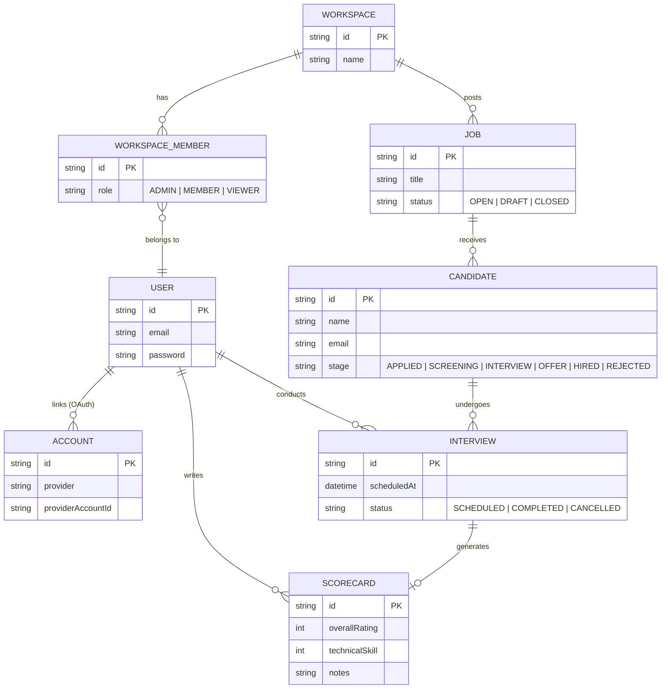

# Architecture

HireTrack is a monolithic full-stack Next.js application built to demonstrate senior-level product engineering.

## Data Model

## Authentication & Authorization

Authentication is handled securely using **Auth.js (NextAuth.js v5)**. The application supports multiple authentication strategies:
- **Credentials (Email/Password)**: Passwords are hashed with `bcryptjs` and stored safely in PostgreSQL.
- **OAuth (Google & GitHub)**: Users can sign in using third-party providers. When a new user logs in via OAuth for the first time, a `createUser` event hook automatically provisions a default `Workspace` for them, making them an `ADMIN` so they can begin using the application immediately without encountering multi-tenant errors.

Upon a successful login, Auth.js signs a secure, HTTP-only JWT token that stores the user's `id`.

Authorization is enforced at both the middleware routing level and the database mutation level:
- **Routing**: `src/proxy.ts` strictly guards the `/dashboard/*` routes. Unauthenticated users are hard-redirected to `/login`.
- **Data Access (RBAC)**: When performing server actions (like `updateCandidateStage` or `submitScorecard`), the server explicitly fetches the authenticated user's `WorkspaceMember` relationship. If a user tries to mutate a Candidate that does not belong to a Job inside their authorized Workspace, the action throws an `Unauthorized` error. Furthermore, Scorecards can only be submitted by the explicitly assigned `interviewerId` for that specific Interview.
