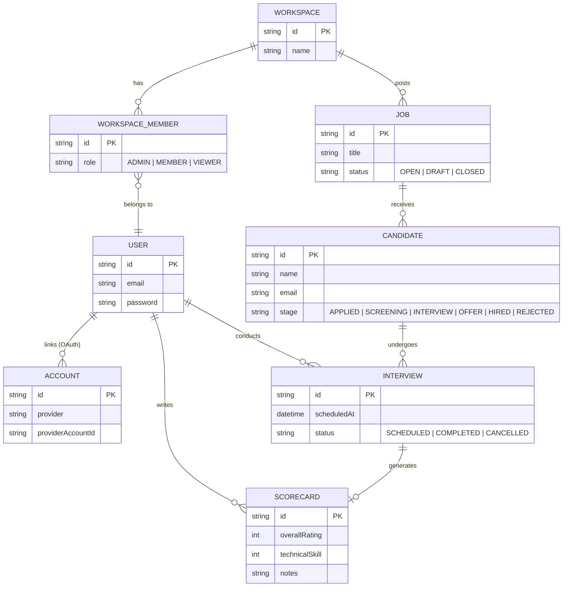

# Architecture

HireTrack is a monolithic full-stack Next.js application built to demonstrate senior-level product engineering.

## Data Model

## Authentication & Authorization

Authentication is handled securely using **Auth.js (NextAuth.js v5)**. The application supports multiple authentication strategies:
- **Credentials (Email/Password)**: Passwords are hashed with `bcryptjs` and stored safely in PostgreSQL.
- **OAuth (Google & GitHub)**: Users can sign in using third-party providers. We implemented a **"Magic Auto-Join"** hook: when an invited user logs in via OAuth, the system automatically detects their email, skips the workspace creation step, and seamlessly deposits them into the inviter's workspace with the correct role. If it is a brand new, uninvited user, a default `Workspace` is automatically provisioned for them.

Upon a successful login, Auth.js signs a secure, HTTP-only JWT token that stores the user's `id`.

Authorization is enforced at both the middleware routing level and the database mutation level:
- **Edge Routing**: `src/proxy.ts` (Next.js 16+ convention) strictly guards the `/dashboard/*` routes using Next.js Edge Middleware. Unauthenticated users are hard-redirected to `/login`.
- **Data Access (RBAC)**: When performing server actions (like `updateCandidateStage` or `submitScorecard`), the server explicitly fetches the authenticated user's `WorkspaceMember` relationship. If a user tries to mutate a Candidate that does not belong to a Job inside their authorized Workspace, the action throws an `Unauthorized` error. Furthermore, Scorecards can only be submitted by the explicitly assigned `interviewerId` for that specific Interview.
